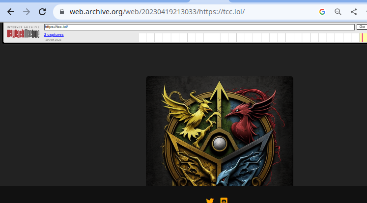
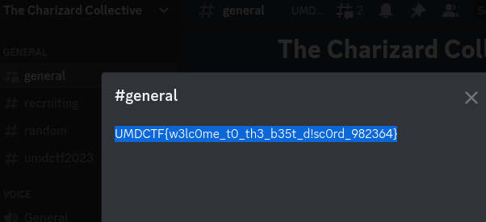

# TCC

This challenge was a perfect example of a very valuable technique in OSINT/forensics and webapp pentesting.

it introduces the concept of the internet archive's [wayback machine](https://archive.org/web/)

The challenge hints that there was a link earlier and had gone since which directly hints to usong the wayback machine to view earlier snapshots of the pages.

here we can see that there is a discord server link that is an invitation link to the server, where we can directly see the flag in the describtion of the `#general` channel

