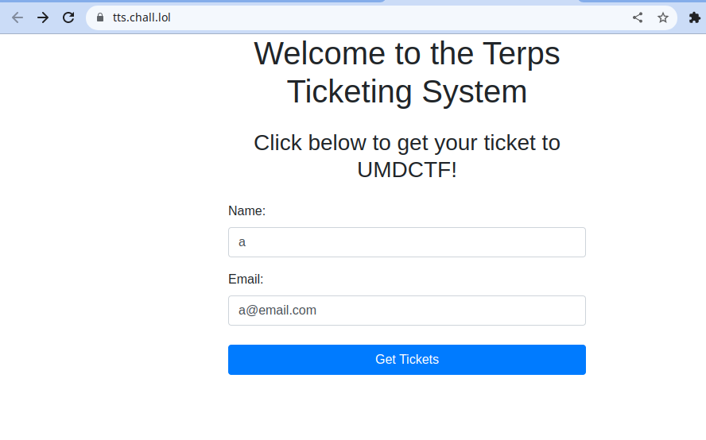
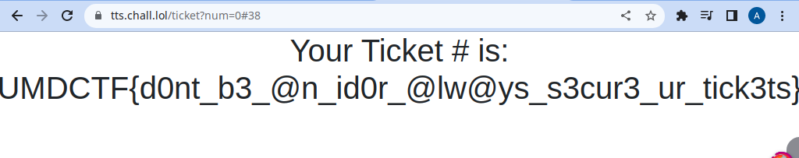

# TTS

That challenge was so easy that it can be done as a ctf speedrun challenge, as it is just an idor.

The app signs the player in and gives him a number that is reflected in the url. So all we needed to do is to change the `num` attribute to `0` and get the flag

