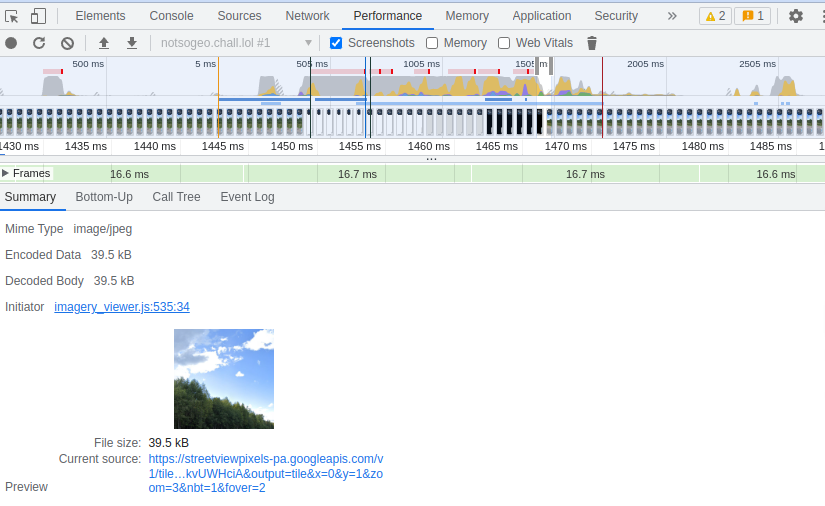
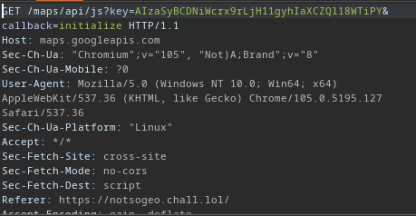
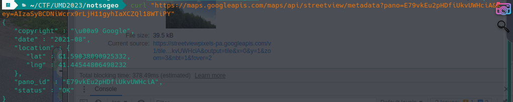
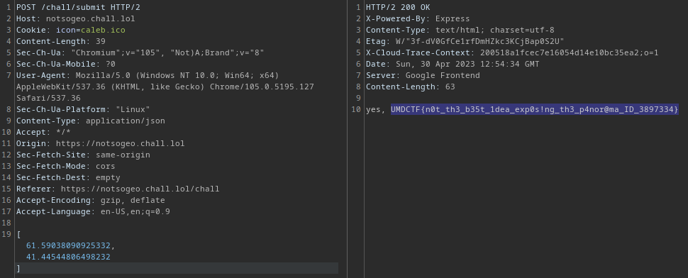

# NotSoGeo


This challenge was so fun and creative but not that easy. It relies heavily on analyzing API calls, and not any APIs, but Google's APIs which are notorious for being so obfuscated.

The aim of the challenge is to pull up the right coordinates of a street view similar to the popular [GeoGuessr](https://www.geoguessr.com/) online game.

Starting off we started analyzing the API calls sent from the browser to see if any of them contained actual coordinates.

one of them was a call to `/maps/apis/ViewPortInfoService.GetViewPortInfo` which contained some coordinates in the URI. That was a very deep rabbithole looking at the google maps documentation to see exactly what these coordinates reffer to. but trying them as a solution didn't yield any result so we ruled out this api call.

Then we noticed some coordinates written to the `/chall.js` file sent from the challenge server in an array called `comp_coord`. But after digging up the coordinates on the map it pointed directly to our houses :joy: so we completely ruled this as well .

## Another way of approaching the challenge

We started looking at what exact information is sent from the challenge server so that the broeser can pull up the right street view from the API. 

The server sends a json file called `info.json` that contains info about the width and hight of the canvas, and also an id called `panoid`,

Here we started dynamically analuzing the app's behavior to see what does it do with the given information.

So we used one of my favourite tools there is, the chrome dev tools with the peroformance tab.



And sure enough the app was pulling the streetview images from the api by only using the panoid and some identifying parameters that indicate the angle of each image shot to be pulled.

here are some examples of those urls:

```
https://streetviewpixels-pa.googleapis.com/v1/tile?cb_client=maps_sv.tactile&panoid=E79vkEu2pHDfiUkvUWHciA&output=tile&x=0&y=1&zoom=3&nbt=1&fover=2

https://streetviewpixels-pa.googleapis.com/v1/tile?cb_client=maps_sv.tactile&panoid=E79vkEu2pHDfiUkvUWHciA&output=tile&x=0&y=0&zoom=0&nbt=1&fover=2

```

Here we concluded that we must search for an api endpoint that can retrieve metadata of a streetview based on that panoid.

So we started searching...cough..cough...chatGPT...cough 

and we found this endpoint:

```
https://maps.googleapis.com/maps/api/streetview/metadata?pano=<PANO_ID>&key=<API_KEY>
```

So we needed a grab an API key, the app uses one to communicate with the google maps API so we can use that and the panoid



and we can simply retrieve the metadata by making a GET request to that URL



And finally submit the coordinates to the app via the `/submit` endpoint to get the flag

