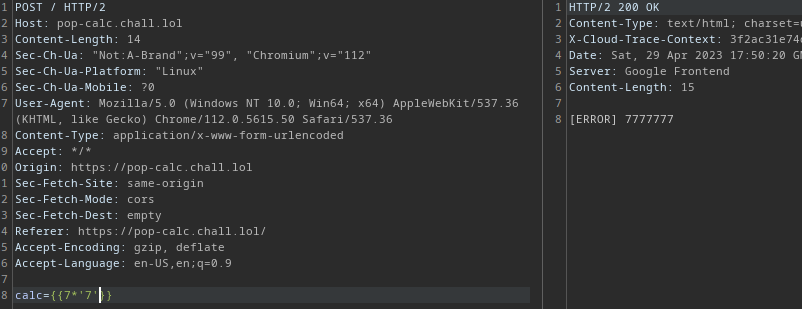

# popcalc 

That is a fairly easy challenge, yet it took us a fair bit of time to solve due to the blackbox nature of the challenge.

it is a simple web calculator that takes a mathmatical expression and returns the value. So we thought that the app might be using some kind of an `eval` function. But when we try to declare a simple variable:

```python
x = 3
```

```javascript
var x = 4;
```

The app only responds with a simple `[ERROR]`, so the whole enumeration became a sequence of trial and error (no pun intended).

At last we came up with the idea that the whole app might be rendered using a templating engine, and sure enough inputting `{{7*'7'}}` gave this:



So immediately we figured out that the server is a flask server running `Jinja2` templating engine

So we can grab a payload and trigger rce to read the flag


