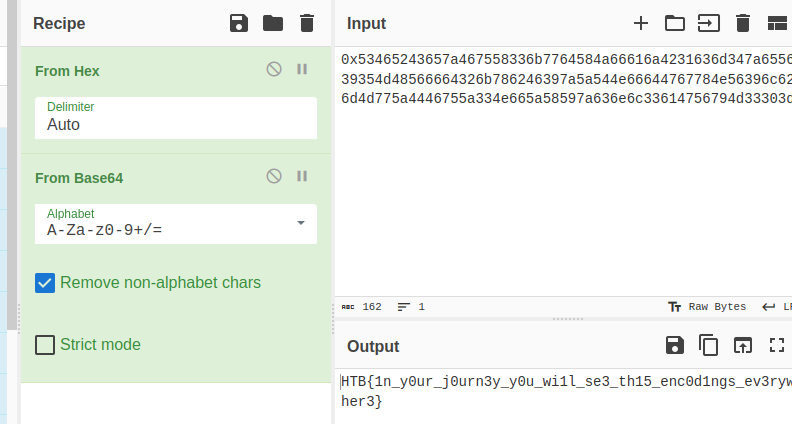

# Ancient Encodings (very easy)

This challenge gives us a small python script that is supposed to encode a message.

```python
from Crypto.Util.number import bytes_to_long
from base64 import b64encode

FLAG = b"HTB{??????????}"


def encode(message):
    return hex(bytes_to_long(b64encode(message)))


def main():
    encoded_flag = encode(FLAG)
    with open("output.txt", "w") as f:
        f.write(encoded_flag)


if __name__ == "__main__":
    main()
```

we can clearly see that the data in the file containing the message is originally base64 encoded and then hex encoded, so to recover that message we can use one of my favorite tools for cryptographic stuff `cyberchef`



and just like that we get the flag!
