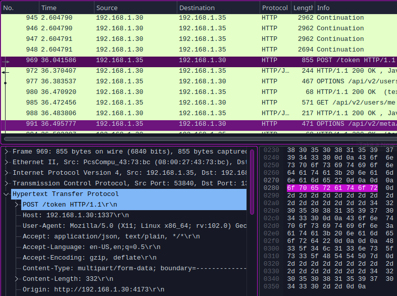
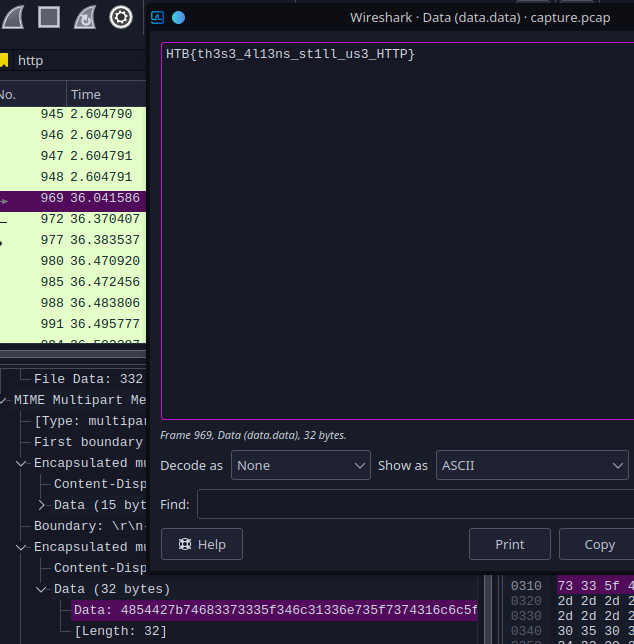

# Plaintext Treasure (very easy)

This challenge is all about using some simple forensics concepts to achieve the goal. It represents a pcap file with the flag inside that we must look for.

Opening the file with wireshark we can directly see that there are some http requests done along the tcp connections, so we can filter pnly to show the http requests.

we know that with http requests important data will most likely be sent via POST requests, so we look into those until we find an endpoint called `/token`

If we expand the data of this request we can see that there are username and password fields, so we can decode the bytes of the password field and we will get the flag!

