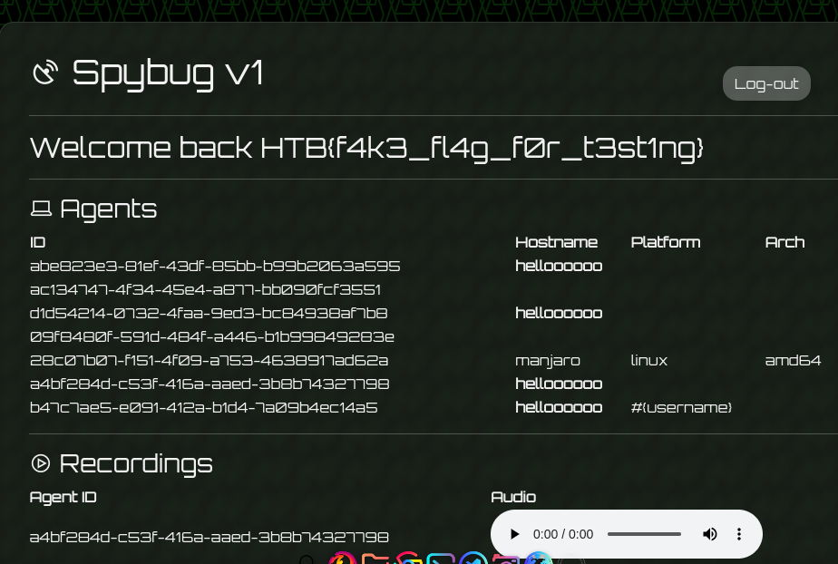

# Didactic Octo Paddles (Medium)

This challenge starts of like the previous challenges with a login screen, but this time there is something hidden we have to look for inside the source code.

At first glance we only see that we can do a login, but looking at the `index.js` file inside the routes folder, we can find this route:

```js
 router.get("/register", async (req, res) => {
        res.render("register");
    });
```

so we can go to the '/register' route and make a new user. 

this challenge has a misleading aspect, that it implements a shopping site for regular users, and a dashboard for the admin.

so after tinkering a lot with the shopping features, we decided to take a look into the session cookie. it is a JWT with a field called id


so if we can control this field we can essentially hijack any user on the platform.

looking at the source code, we can see this check done in `AdminMiddleware.js` file:

```js
if (decoded.header.alg == 'none') {
            return res.redirect("/login");
```

this check insures that the algorithm isn't swapped by `none`, but we can easily bypass that by changing the case of the characters for example to `NoNe`. [This](https://infosecwriteups.com/attacks-on-json-web-token-jwt-278a49a1ad2e) article talks about this kind of algorithm swap attack in detail.

After changing the id to 0 we will be able to access the admin panel through the '/admin' route and will be greeted with the usernames of all the registered users on the site

taking a look back at the views we see that the app uses jsrender template engine to render the site's templates, and it unsafely includes the usernames which screams out `SSTI`

so all we have to do is grab a payload from [hacktricks's](https://github.com/carlospolop/hacktricks/blob/master/pentesting-web/ssti-server-side-template-injection/README.md) github repo and read the flag 

via registering a user with this username:

```js
{{:"pwnd".toString.constructor.call({},"return global.process.mainModule.constructor._load('child_process').execSync('cat /flag.txt').toString()")()}}
```

and just like that we get the flag

