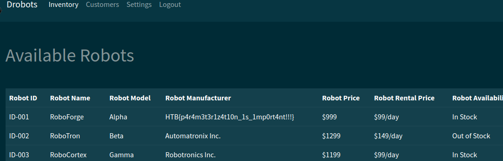

# Drobots (very easy)

This is a pretty simple and straight forward challenge

once the instance is spawned we are greeted with a login screen that has nothing other than a login field, no register field which suggests that either there is something hidden or the login field itself is vulnerable to `SQLI`

viewing the database handler `database.py1 file we immediately see this function with a nice message from the dev:

```python
def login(username, password):
    # We should update our code base and use techniques like parameterization to avoid SQL Injection
    user = query_db(f'SELECT password FROM users WHERE username = "{username}" AND password = "{password}" ', one=True)

    if user:
        token = createJWT(username)
        return token
    else:
        return False
```

it injects the user input directly into the sql statement and doesn't use a pre-prepared statement. And seeing the syntax of the statement we can figure out that the database in use is Mysql.

So if we just close the double quotes after the username and inject our own SQL logic we can get in the app with ease

```SQL
admin" OR 1=1; --
```
as for how we got to know that a user called `admin` exists in the database, we can look at the `entrypoint.sh` file that contains the following SQL statement

```SQL
INSERT INTO drobots.users (username, password) VALUES ('admin', '$(genPass)');
```


and just like that we get the flag on the dashboard

