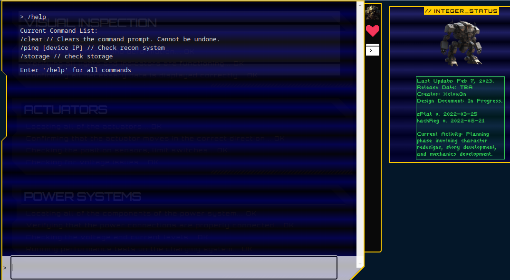

# Gunhead (very Easy)

Starting out with the challenge we immediately see that this web app is a simple yet visually stunning web app that has some kind of an interactive console 



trying those commands out yields expected results, the '/help' command shows the available commands, the '/clear' command clears the screen, the '/storage' shows some storage info and lastly the '/ping' command does a ping on an ip we provide

## Code analysis

taking a quick glance at the provided source code we can see that it uses the [MVC](https://en.wikipedia.org/wiki/Model%E2%80%93view%E2%80%93controller) architecture, so the application backend logic will be stored in the model.

```php
<?php
#[AllowDynamicProperties]

class ReconModel
{   
    public function __construct($ip)
    {
        $this->ip = $ip;
    }

    public function getOutput()
    {
        # Do I need to sanitize user input before passing it to shell_exec?
        return shell_exec('ping -c 3 '.$this->ip);
    }
}
```
This model class is a handler to the '/ping' command, and we can see that it uses the `shell_exec` function with the user supplied ip directly concatenated to the argument which indicates that the app is vulnerable to shell code injection

so simply appending to the ip additional shell commands yields command injection as so

