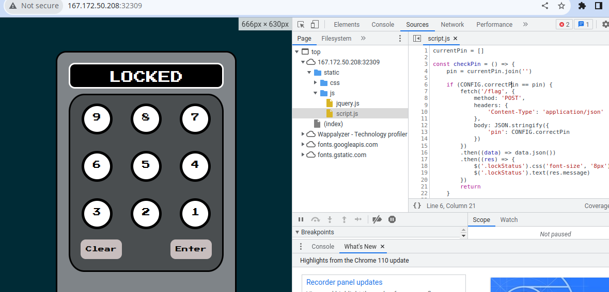
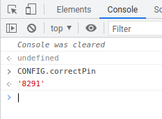
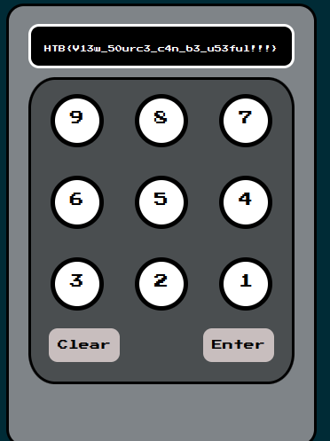

# Trapped Source (very easy)

That was a very easy challenge that was all about looking at the source code of the client side app to bypass the pin code puzzle.

going through the main script js file we can see how the app works 

the app calls the function `checkPin` that sends a post request with the pin we provide in case it is the correct pin. The pin validation is done on the client side, so we can simply read the pin from the browser's console

So we just provide that pin and grab the flag!

