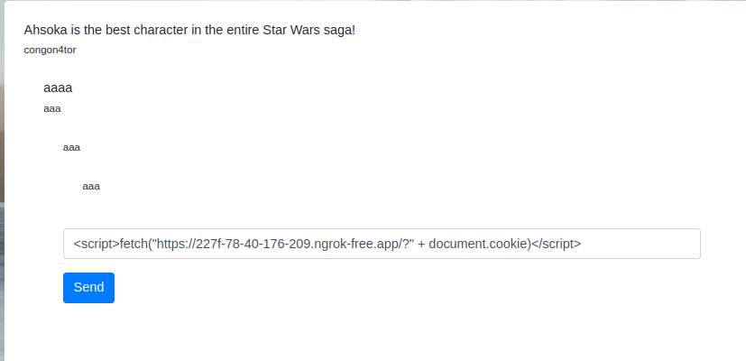
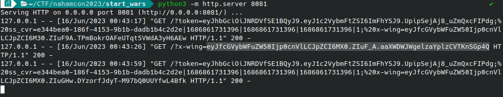
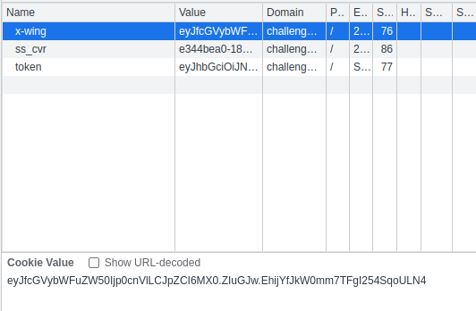
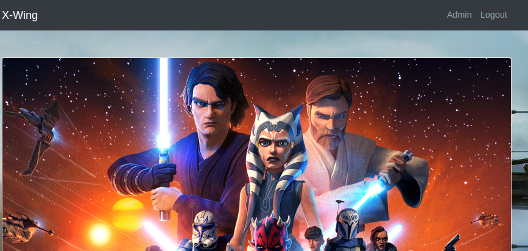
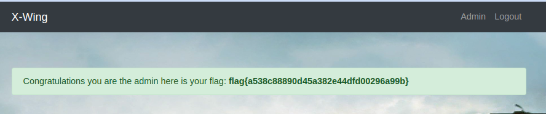

# Star Wars (Medium)

This challenge was so Typical and easy that I was surprised that it was ranked as a medium, but in any case it is just your typical XSS admin cookie stealing thing.

Right off the bat when we enter into the main page we get an error that the session is invalid. Then we can just create an account to sign in and get a session.

after that we will only see one blog by the admin in which we can comment to at the bottom of the oage.

If we just inject regular HTML like `<u>Hello</u>` we will get an underlined Hello word

So we can just try to inject a script tag including a callback to our domain using the built-in fetch API

and then we open an http server that we can point ngrok or any domain we own to and wait for a callback after the admin bot reviews the comment

After that we just plug in the document cookie into our sessionm cookie field and refresh the page to get access to the admin panel

And there we get the flag

