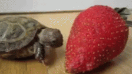
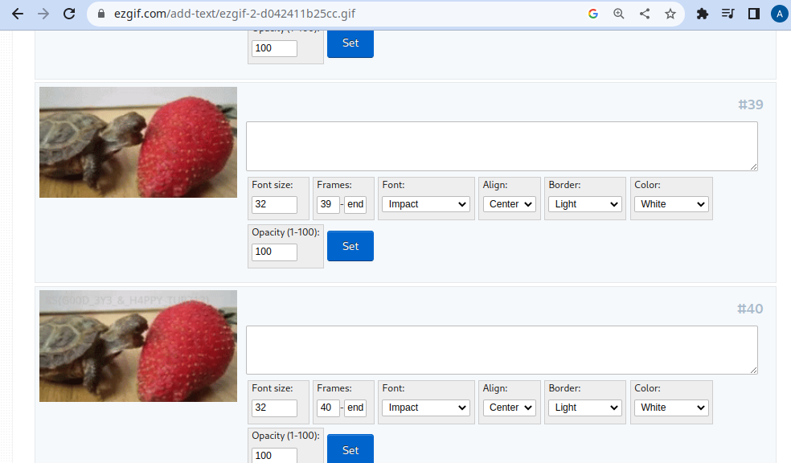
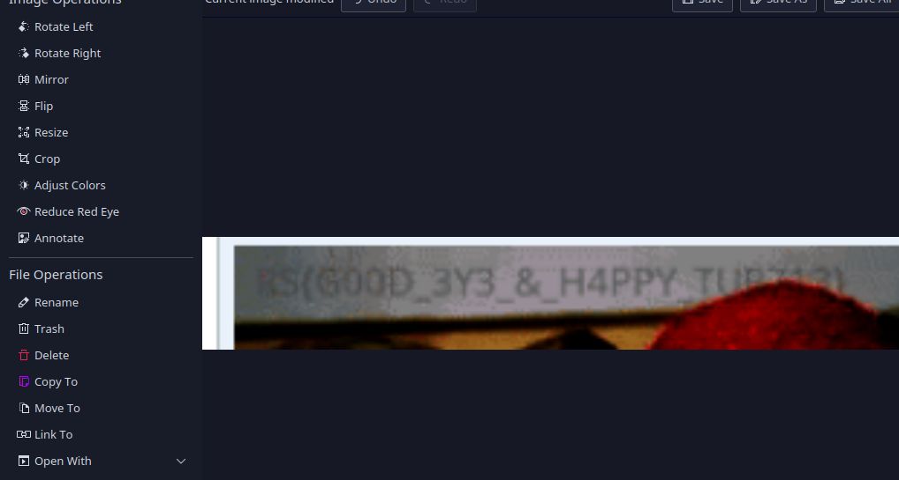

# Turtle

That challenge was an easy one to solve, but a really hard one on the eyes.

we have a gif that contains the flag.



So the first thing we did is looking at the metadata, it's when we found that the gif was made by [ezgif](https://ezgif.com). Our first thought that this tool had a functionality to hide messages inside a gif file, but the closest thing we found was to write a message on a frame inside a gif.

Here we uploaded the gif and inspected the frames one by one until we finally found the flag written on frame `#40`



So we cropped and adjusted the frame and started the mission of figuring out the characters of the flag




after so many attempts, we found out that Turtle was written as `TUR713` and GOOD was written as `G00d` with zeros which wasted us so much time and effort.

but we finally got the flag

```
RS{G00D_3Y3_&_H4PPY_TUR713}
```