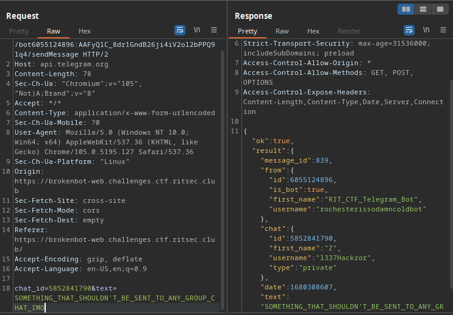

# Broken Bot

This challenge was so fun that it made us research how the telegram API works and how it is formatted.

starting off the challenge we get a page that looks for RIT that prompts us to enter a password. 

So we tried to enter some passwords but every time we get redirected to a weird [voice mail](https://archive.org/details/VoiceMail_173) on the internet archive uploaded way back from 2008 so probably that has nothing to do with the challenge.

Then we started looking at teh http requests made by the web app, and then we found some interesting and disturbing api calls being made. Some were IP info and others were location data being gathered and sent to a telegram channel via the telegram API.

So to better undertand the communication process made we went directly to the telegram api [docs](https://core.telegram.org/methods). There we found out that the api call `sendMessage` being used is one of many methods used by a class called `messages`. So we gathered a list of all the methods and started a to enumerate the api calls to see which ones are in use.

We found out that all of them were accessible, so we started looking at interesting endpoints. Here we found the two endpoints `getMe` and `forwardMessage` that we thought needed to be chained to exfiltrate all the data from the private groupchat that the api adds data to. Our idea was to add the bot to a group chat we own on telegram, then use the forwardMessage api call to send the messages from message id 1 and onwards.

the forwardMessage method requires three parameters, from_chat_id, chat_id (our group's id) and message id which we all have. 

So when we tried to get a message the api complained that the bot isn't a member of our group. Here we got it's data from the getMe call 

and went to telegram to see how can we add the bot using his username or id.

But to our surprise the flag was right there in the bot's BIO

it's certainly was a much simpler idea than ours (which essentially was the flag being inside the chat logs of the private chat). And definitely it would have been much fun to use forwarded messages api, but hey we solved the challenge either way.