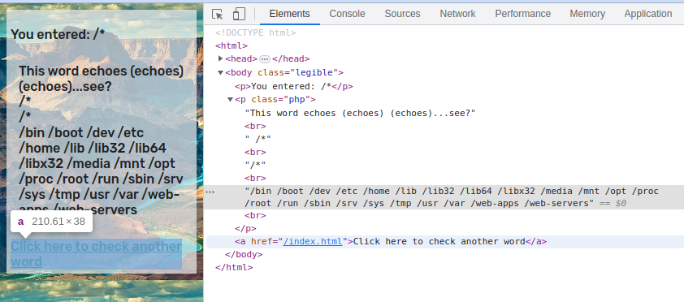
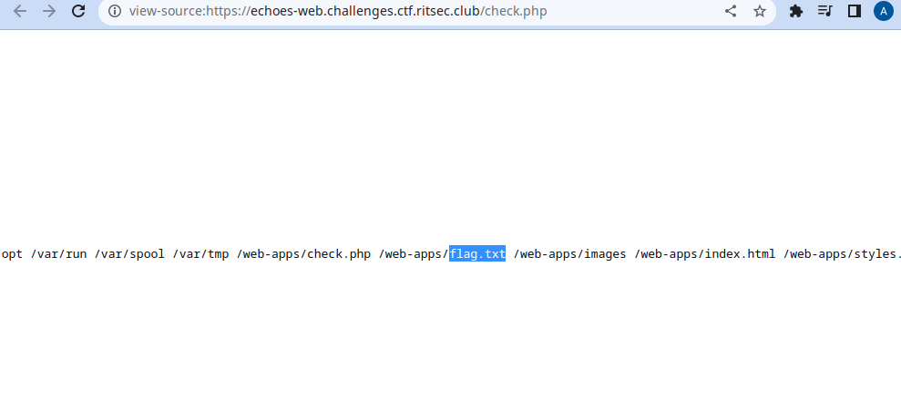
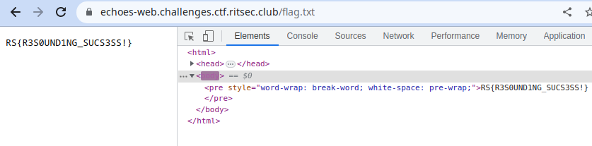

# Echoes

This challenge had a lot of guessing and some misleading functionalities.

To start off, it is just a web app that echoes out what we input in the given input box. That by itself screams the possibility of an XSS.

I say the possibilty because it is a black box engagement and the only way to find out is by trial and error.

after injecting some html tags and seeing that we are getting some html injection we can theorize that the backend does something simillar to this:

```php
<?php echo $_POST['php']; ?>
```

now that by itself doesn't allow us to get something like an RCE or anything because the input is inside an echo (which is suggested due to the challenge's name).

Yet we tried to inject some php tags to see the response, and to our surprise it escapes php tags 
```
<? gets escaped to <!--?
?> gets escaped to -->
```
effectively making an html comment out of it. So that filtering mislead us into trying hard to evade the filter.

here we stumbled upon trying to inject a multi-line php comment `/**/` 
But to our surprise that lead to some directory listing as if there is a function envoked that lists the contents of the root direcory `/` and matches everything due to the asterisk `*`



The backend was so weird that it rarely accepted the payload. Like it only listed directories if the asterisk was at the end, so we were able to recursively list layers of the file system using such payloads:
```
/*/* lists two levels down recursively 
/*/*/* lists three levels down recursively
```
And we searched for `flag.txt` in the results


It was in the same directory called web-apps that contained index.html and check.php which points out that it is in the web directory. So if permissions of the flag file are open to be read by anyone, we can just call flag.txt from the root on the url bar

And sure enough there it was


## Final Thoughts

It was a fun challenge but had a lot of solves probably since a lot of players might be throwing automated scanners at it, so it would have been better if there was another aspect of the challenge that could mitigate that.

# Another method

It appears that the challenge also has a command injection aspect as mentioned in [this write-up](https://siunam321.github.io/ctf/RITSEC-CTF-2023/Web/Echoes/). it appears that the code actually executes shell echo command, something like:


```php
<?php echo system("echo " . $_POST['php']); ?>
```

so adding a new line character and a command (url encoded), something like "a+%0a+id" will execute the `id` command