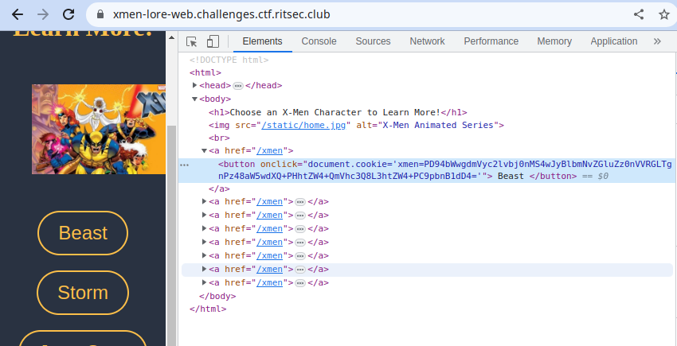
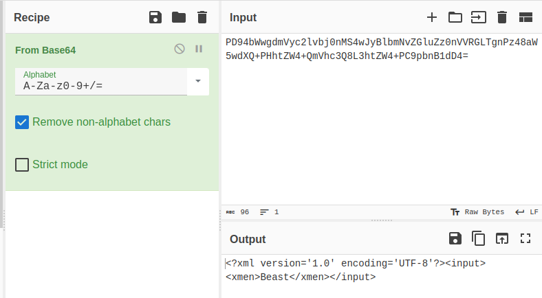
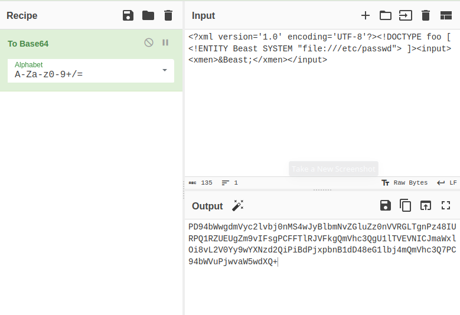
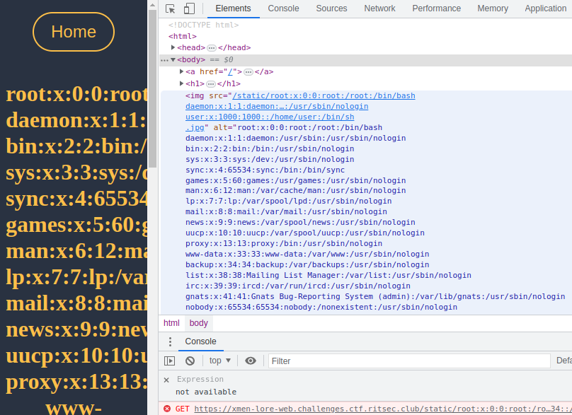
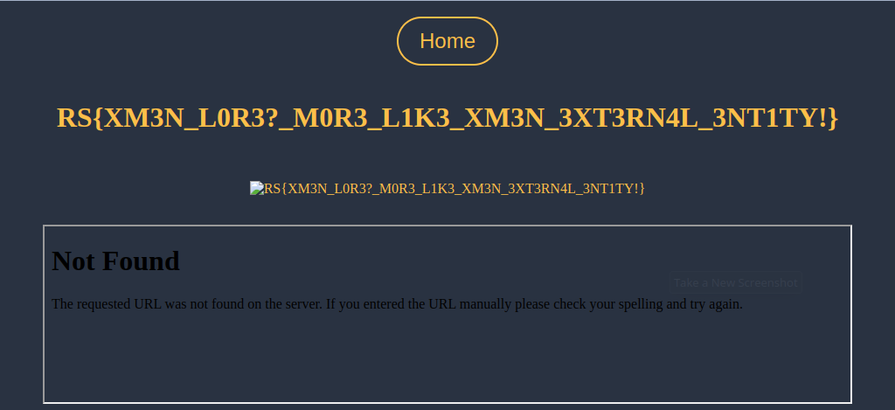

# Xmen Nostalgia

This challenge was pretty straight forward if the player is familiar with the concept of XXE (I suggest learning about it from [portswigger academy](https://portswigger.net/web-security/xxe))

Navigating to the page we see that it is a web app that navigates to an endpoint called `/xmen` once we click on a certain xman and we get information specific for that xman. So it is probably using some kind of an identifier inside the html page that let's the server know which button we clicked.



So it sets a user cookie with the request that contains base64 encoded data. Plugging it into cyberchef we can see the following:



So as we can see this payload is some xml data that the server uses to identify the page to send over. Thus the first thing we can look for is XXE and try to read the `/etc/passwd` file



And if we encode that xml payload and set it as our cookie, we sure can read the passwd file



Now we know that we can exfiltrate arbitrary files from the server, so we can try to guess the flag location using such payloads:

```xml
<?xml version='1.0' encoding='UTF-8'?><!DOCTYPE foo [ <!ENTITY Beast SYSTEM "file:///flag"> ]><input><xmen>&Beast;</xmen></input>

<?xml version='1.0' encoding='UTF-8'?><!DOCTYPE foo [ <!ENTITY Beast SYSTEM "file:///flag.txt"> ]><input><xmen>&Beast;</xmen></input>

```

So we try setting the cookie each time until we find the file and get the flag

